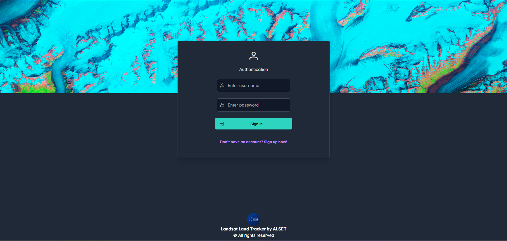
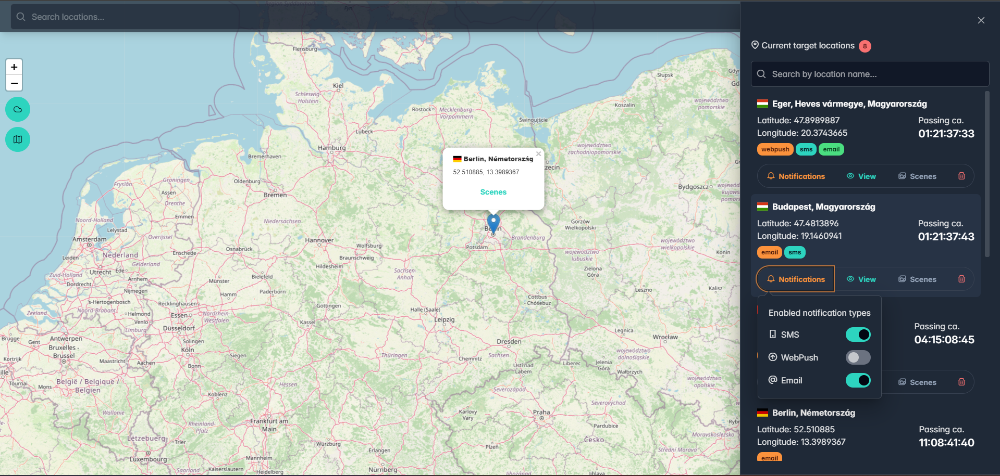
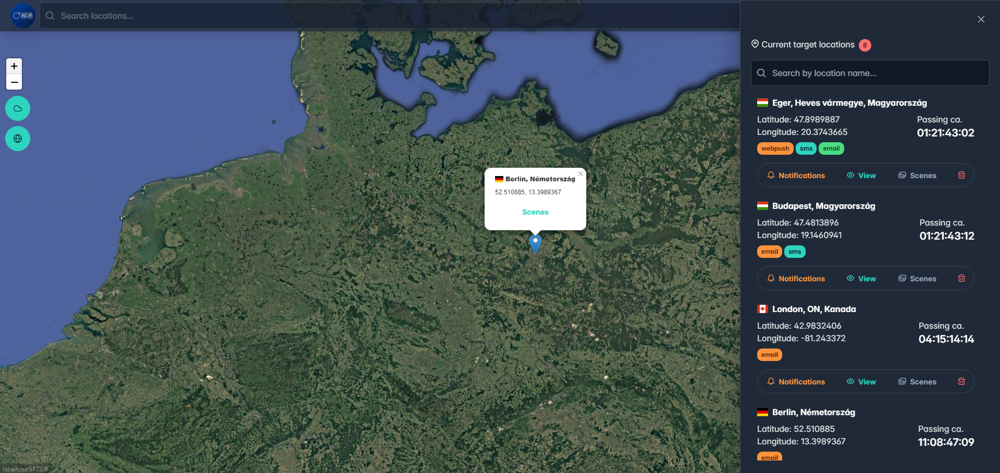
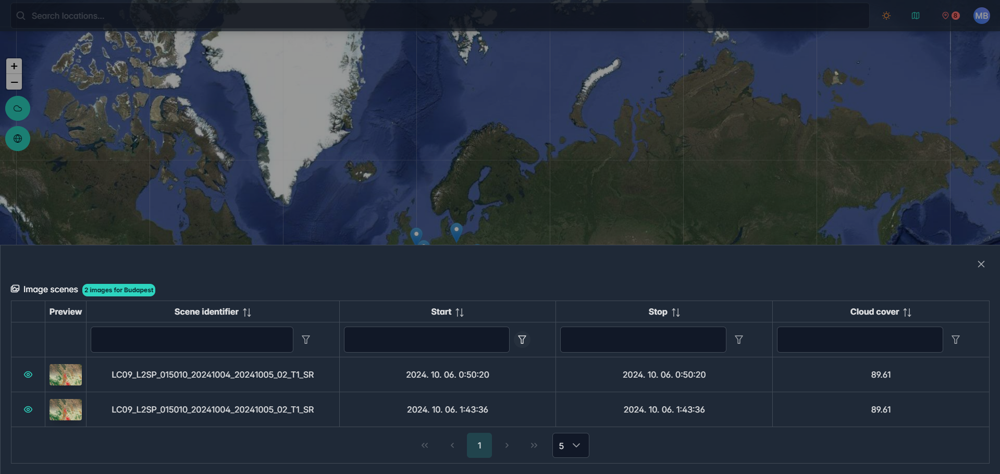
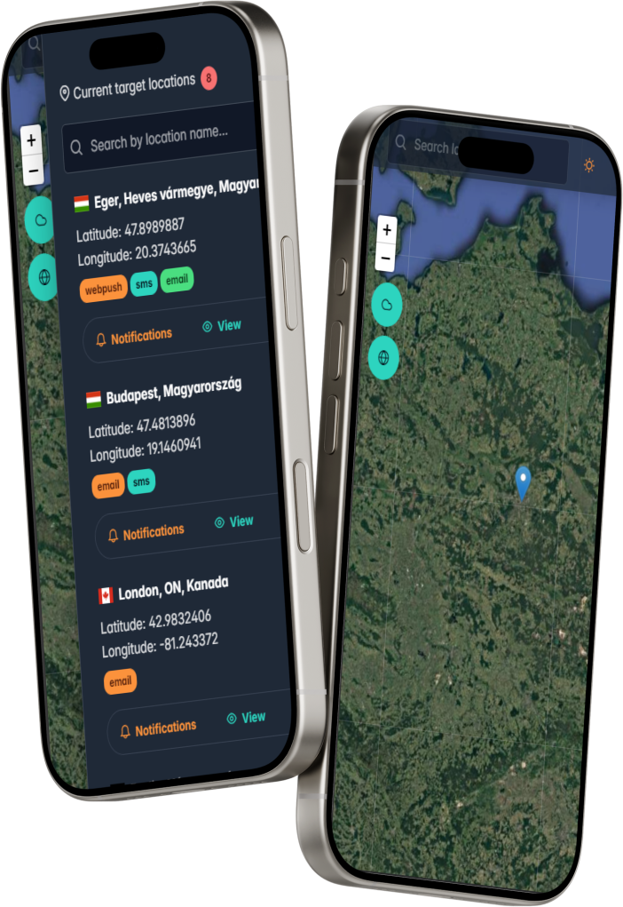
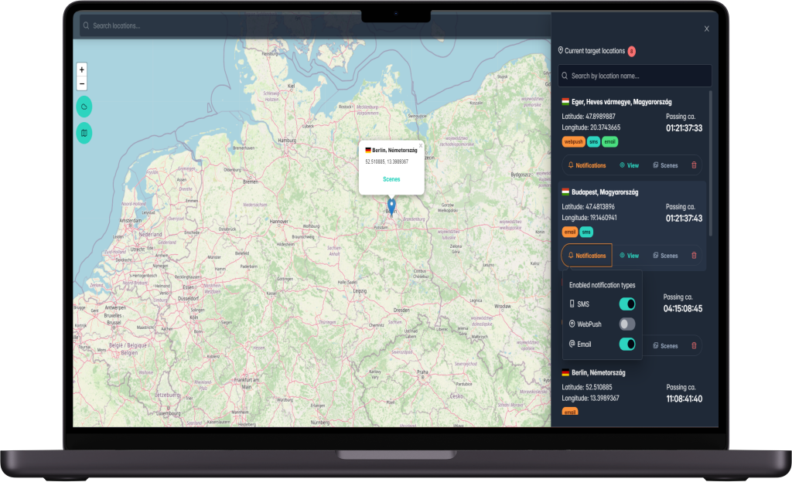

# NASA Landsat 8-9 Based Application

## Summary:
This application enables users to search for locations using forward lookup based on NASA's Landsat 8-9 imagery. Users can place custom markers on a map and associate notifications (email, web push, or SMS) with each marker. The map offers both a 3D view and a standard 2D view, with options for street or satellite layers. The app is built using the latest versions of the MERN stack, PrimeReact UI, Tailwind CSS, and several external APIs to handle geospatial data and forward lookup functionalities.

## Features:
1. **Search Functionality:**
    - **Forward Lookup:** Users can search for specific locations by typing the location name or coordinates. Forward lookup is powered by the OpenCage API.

2. **Map Integration:**
    - **3D Map View:** Users can switch to a 3D perspective using Three.js and harp.gl to visualize terrains and locations in 3D.
    - **2D Map View:** Offers both street view and satellite view, with imagery based on Landsat 8-9 data.

3. **Target Management:**
    - **Marker Placement:** Users can drop markers on the map to identify specific locations.
    - **Notifications:** Each marker can have notifications assigned to it. The three supported notification types are:
        - Email
        - Web Push
        - SMS

## Technology Stack:

| Technology       | Usage                                           | Latest Version   |
|------------------|-------------------------------------------------|------------------|
| **MongoDB**      | Database for storing user data, locations, and notifications | Latest           |
| **Express.js**   | Backend API and server handling requests        | Latest           |
| **React.js**     | Frontend framework for building the user interface | Latest           |
| **Node.js**      | Server-side JavaScript runtime environment      | Latest           |
| **PrimeReact**   | UI components for user interface (forms, buttons, etc.) | Latest           |
| **Tailwind CSS** | Styling and layout of the application           | Latest           |
| **gdal**         | Processing geospatial data from satellite imagery | Latest           |
| **USGSm2m API**  | Used to retrieve Landsat 8-9 imagery and metadata | Latest           |
| **Satellite.js** | Satellite imagery management and manipulation   | Latest           |
| **Three.js**     | 3D rendering and scene creation for the map      | Latest           |
| **harp.gl**      | 3D map rendering and navigation                 | Latest           |
| **OpenCage API** | Forward lookup (converting location names into coordinates) | Latest           |

## Detailed Functionality:
1. **Forward Lookup (OpenCage API):** Users can search for locations by name, and the app retrieves the geographical coordinates (latitude and longitude) using the OpenCage API. This allows the user to find any location across the globe and place markers accordingly.

2. **Map Views (harp.gl, Three.js):**
    - The user can switch between a 2D map (with options for street and satellite views) and a 3D view for a more immersive experience.
    - The 3D view uses Three.js and harp.gl to render realistic terrains, allowing the user to visualize the depth and topography of the region.

3. **Marker and Notification Management:**
    - Users can drop markers on the map, representing locations of interest.
    - For each marker, users can assign notifications (Email, Web Push, SMS) so they can receive alerts based on events (e.g., weather changes, satellite pass-overs) related to these locations.

4. **External APIs:**
    - **GDAL:** Handles geospatial data, such as satellite imagery from Landsat 8-9, to ensure accurate mapping.
    - **USGSm2m API:** This API fetches metadata and images from Landsat satellites, integrating it into the map for detailed satellite views.

## Preview
### 1. Application preview

### 2. Phone mockup

### 3. Laptop mockup

